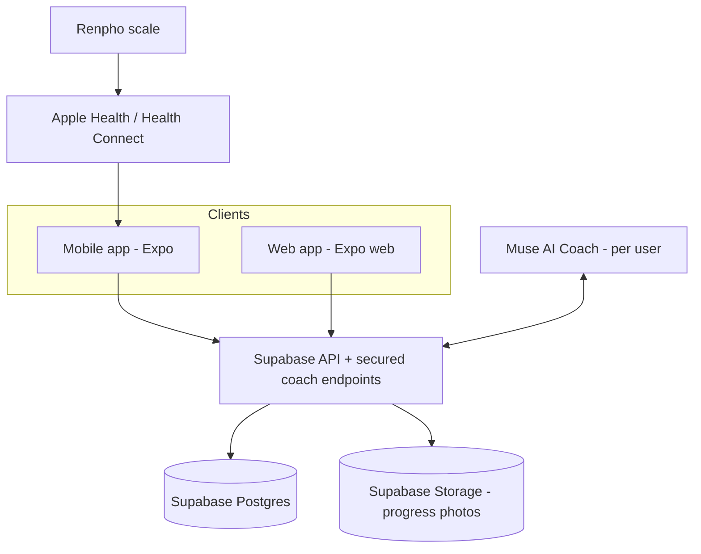
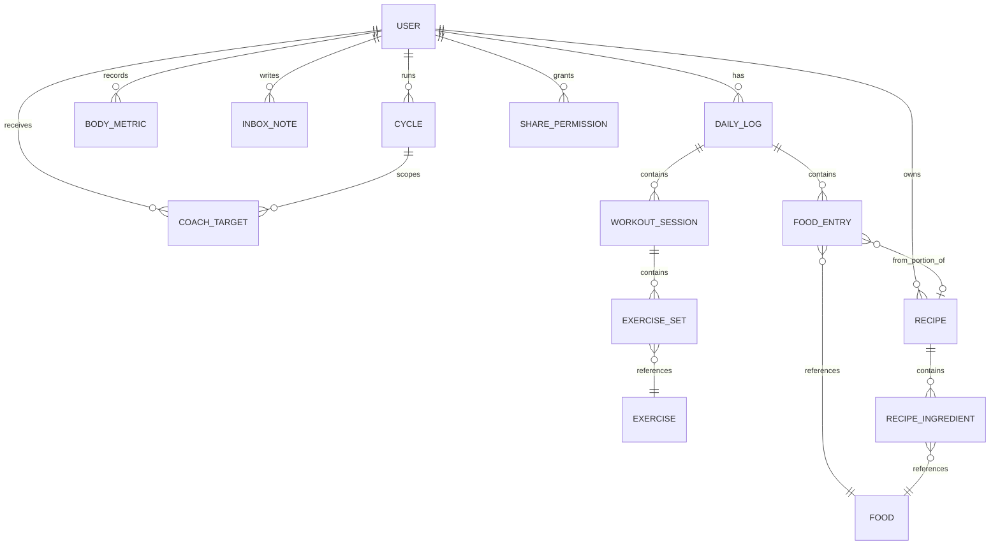

# Adonis — Planning Document

> Living planning doc. No code yet. We refine this until the plan feels right, then build **inside this `Adonis` folder only** — fully siloed from the separate "Atlas" project (separate repo, deps, and database; no shared imports).

_Last updated: 2026-09-20_

---

## Build status (v0 scaffolded)

The end-to-end skeleton is built and bundles cleanly (typecheck + web export pass). See [README.md](README.md) to run it.

- ✅ Expo + TypeScript + expo-router app (auth, Today, Food, Body, Coach, Profile)
- ✅ Pure domain logic: adaptive expenditure engine, target calculator, recipe portioning, trend/EWMA + stall detection
- ✅ Supabase schema + RLS migrations + signup trigger
- ✅ Data layer + Open Food Facts barcode lookup
- ✅ Muse scoped edge function (`summary`, `set_target`, `log_weight`, `add_note`, `log_food`)
- ⬜ Next: recipe UI, health/scale sync (EAS build), camera barcode scan, Muse Inbox UI, sharing UI, cycles UI, micronutrient charts

---

## 1. Concept

A personal, cross-platform health platform for **2 users (me + partner)** that unifies:

- **Nutrition** — calories + macros, barcode lookup, manual per-100g entry, recipe/bulk-cook portioning
- **Exercise** — workouts, sets/reps/weight, cardio
- **Body metrics** — weight (auto from scale), measurements, progress photos
- **AI Coach (Muse)** — sets & adjusts targets from trends, does weekly check-ins, tidies messy notes, gives evidence-based guidance

Differentiator: it's **adaptive and ongoing**, not a fixed program. Muse acts as the brain; the app is the data layer + interface. Automation-first: minimal manual input.

## 2. Users & scope

- 2 users to start: me + partner. Each has their own data, targets, and **their own Muse account** (one Muse works for me, one for her).
- Multi-user from day one (shared app, separate profiles).
- **Sharing = invitation + granular toggles ("Find My" model).** Data is private by default. You invite the other person; they accept. Each side toggles _what_ is shared (weight trend, food logs, photos, workouts), revocable anytime. Modeled by a `SharePermission` entity.
- **Recipe sharing = publish flag.** A recipe has `visibility` (private / shared). When published, it appears in the partner's food search so either person can portion from it. (See §7.)

## 3. Constraints & goals

- **Budget:** free, ideally; hard ceiling ~$5 CAD/month for infra. Aim for $0 infra. (Muse/AI usage cost is separate, on the Muse plan.)
- **Automation:** daily weigh-in and syncing should be near-zero-effort, efficient, science-backed, evidence-based.
- **No fixed program length.** Progress is organized into **Cycles** (see §9a): a Cycle = a goal + optional target date + Muse-generated plan. E.g. Cycle 1 = "cut, target Dec 20 vacation"; Cycle 2 = "maintain" (no end date). Cycles chain over time. Can also run indefinitely.

## 4. Recommended tech stack (for discussion)

| Layer                              | Choice                                                                                                                          | Why                                                                                                                                                                                 |
| ---------------------------------- | ------------------------------------------------------------------------------------------------------------------------------- | ----------------------------------------------------------------------------------------------------------------------------------------------------------------------------------- |
| App (mobile + web)                 | **Expo (React Native + React Native Web), TypeScript**                                                                          | One codebase → iOS, Android, and web. Free.                                                                                                                                         |
| Backend + DB + Auth + file storage | **Supabase (free tier)** — _confirmed vs Mongo/Firebase_                                                                        | Postgres + auth + storage for photos + auto-generated REST API. Generous free tier; 2 users stays free.                                                                             |
| Backend logic / API for Muse       | Supabase auto REST/RPC + **TypeScript Edge Functions** (no separate backend language)                                           | One language (TS) app+backend, $0, no server to host. Rust/Go add a second language + a paid host for no benefit at 2 users. If a standalone service is ever needed → Go, not Rust. |
| Health data                        | **Apple HealthKit** (iOS) / **Health Connect** (Android) via Expo Dev/EAS build                                                 | Read weight from Renpho → Health → Adonis. Requires native modules → **not** Expo Go.                                                                                               |
| Food data                          | **Open Food Facts** (primary, barcode, free/ODbL) + **USDA FoodData Central** (fallback, public domain) + manual per-100g entry | MFP-like lookup, fully free. See §7a.                                                                                                                                               |

Notes:

- **Why not MongoDB Atlas?** M0 is free but gives _only_ a DB — we'd hand-build auth, photo storage, and the API. Our data is relational (users→logs→entries→recipes). Also, **"Atlas" is the name of the other, siloed project** — avoiding MongoDB Atlas here also avoids naming/mental convergence. Supabase wins.
- Supabase free tier (500 MB DB, 1 GB storage, 50k MAU) covers 2 users comfortably. It **pauses after 7 days inactivity** — with daily use this never triggers; optional GitHub Actions cron ping keeps it warm.
- **Photo storage overflow plan:** progress photos are the main space consumer. Store in Supabase Storage (1 GB); if outgrown, offload originals to **Cloudflare R2** (10 GB free, no egress) and keep thumbnails local. Keeps us at $0.
- **Muse security:** scoped token per Muse account + Postgres **Row-Level Security** so each Muse only touches its own user's rows; AI writes go through a small set of `SECURITY DEFINER` RPC functions (guardrails on what it can mutate).
- **Web can't read the scale** — HealthKit/Health Connect are mobile-only. Web = view/edit surface; the phone app ingests weight and writes `BodyMetric` rows.
- Expo lets the partner install via a link / store; web is the same code. Health sync requires an **Expo Dev/EAS build** from day one.

## 5. Architecture

- **Clients:** shared Expo codebase for mobile + web.
- **Health sync:** Renpho → Apple Health / Health Connect → app reads weight automatically.
- **Muse:** connects to a secured API to read data (weights, food, photos, trends) and write (targets, check-in notes, tidied entries). One Muse account per user, each scoped to only their own data.

## 6. Data model (first draft)

| Entity               | Key fields                                                                                             |
| -------------------- | ------------------------------------------------------------------------------------------------------ |
| **User**             | id, name, height, birthdate, sex, activityLevel, goal, museAccountRef                                  |
| **DailyLog**         | id, userId, date, notes                                                                                |
| **Food**             | id, name, source (barcode/manual), per100g: calories, protein, carbs, fat; barcode?                    |
| **FoodEntry**        | id, dailyLogId, foodId?, recipeId?, grams, meal                                                        |
| **Exercise**         | id, name, type (strength/cardio), muscleGroup                                                          |
| **WorkoutSession**   | id, dailyLogId, name, durationMin                                                                      |
| **ExerciseSet**      | id, sessionId, exerciseId, reps, weight, restSec                                                       |
| **BodyMetric**       | id, userId, date, weight, bodyFat?, waist?, chest?, photoUrl?, source (health/manual)                  |
| **CoachTarget**      | id, userId, effectiveDate, calorieTarget, proteinTarget, rationale, setBy (muse/manual)                |
| **Recipe**           | id, userId, name, cookedWeightG, totalCalories, totalMacros (derived), **visibility (private/shared)** |
| **RecipeIngredient** | id, recipeId, foodId, rawGrams                                                                         |
| **InboxNote**        | id, userId, rawText, status (pending/processed), createdAt                                             |
| **Cycle**            | id, userId, name, goal (cut/maintain/bulk/recomp), startDate, targetDate?, status (active/completed)   |
| **SharePermission**  | id, ownerId, viewerId, scopes[] (weight/food/photos/workouts), status (pending/accepted/revoked)       |

Key ideas:

- **CoachTarget replaces fixed program weeks** — Muse writes a new target whenever it adjusts, with a rationale; app compares intake against the current target. Targets are scoped to the active **Cycle**.
- **Food** also carries optional **micronutrients** (fiber, iron, calcium, vitamin D, sodium, etc.) when the source provides them, so Muse can flag nutritional gaps (Cronometer-style).

## 7. Feature: Recipe / bulk-cook portioning

Flow:

1. Log each raw ingredient by weight (barcode for packaged like oil/rice; manual per-100g for produce via quick lookup).
2. App sums total calories/macros for the whole dish.
3. Enter the **finished cooked weight** of the dish.
4. App computes calories/macros **per gram** of finished dish.
5. When you eat, weigh your portion → app logs the exact calories/macros as a `FoodEntry` referencing the recipe.

This handles water loss/gain in cooking correctly by normalizing to final cooked weight.

**Publishing / sharing recipes:** a recipe's `visibility` can be set to **shared**. When shared, it appears in the partner's food search, so if she builds "chicken curry" (raw ingredients + final cooked weight) once and publishes it, either person can weigh their portion and log their exact calories/macros from that same recipe. One entry, both benefit.

## 7a. Feature: Food data & lookup

- **Primary source: Open Food Facts** — free, barcode-first, growing Canadian coverage. Requires visible **attribution + ODbL link** in-app, and 1 API call per real scan (cache results).
- **Fallback: USDA FoodData Central** — public domain (CC0), best for generic/whole foods & produce ("chicken breast, raw").
- **Manual per-100g entry** — for anything not found (e.g. fresh produce via quick lookup).
- **Verified personal food table:** every barcode miss or manual entry is saved once to our own `Food` table and reused → avoids MFP's messy-data problem.

## 8. Feature: Muse Inbox

- A quick "dump" box: messy notes ("ate 2 rotis, chicken curry bowl, coffee w/ milk").
- Muse reads `InboxNote`, converts to structured `FoodEntry`/`BodyMetric` rows, marks note processed.
- You confirm/adjust. Reduces friction to near-zero.

## 9. Feature: Adaptive coaching (Muse)

**Core engine (MacroFactor-style adaptive expenditure — the differentiator):**

- Don't set a static TDEE. Treat expenditure as a **hidden variable** Muse continuously re-estimates by comparing **actual weight change vs. the change predicted from logged intake**. Lose faster than predicted → expenditure was underestimated → targets rise (and vice versa).
- Balance **responsiveness vs. stability** with a lookback window (avoid big weekly swings).
- **Goal-aware & predictive**: bias initial targets by intended rate of loss/gain; proactively shift when the goal flips (cut↔bulk).
- Operates on **smoothed weekly-average weight** (rolling/EWMA), not daily noise; explicit **stall detection** (2+ weeks flat on-target → adjust).
- Protein anchor ~1.6–2.2 g/kg (up to ~3.5 g/kg aggressive cut).
- Writes a new `CoachTarget` with a **rationale** and `setBy = muse` whenever it adjusts; user can override (`setBy = manual`).

**Interaction:**

- Weekly check-in conversation per user (Carbon Diet Coach-style cadence).
- **Photo feedback tone:** supportive, body-neutral, constructive, trend-focused — never shaming. Photo BF% is directional only; scale + tape are the real signal.
- Standing safety note: not medical advice; flag big diet/training changes for professional input.

## 9a. Feature: Cycles (replaces fixed program)

- A **Cycle** = a goal + optional target date + Muse-generated plan. E.g. _Cycle 1: cut, target Dec 20 vacation._
- When a cycle ends, start the next (_Cycle 2: maintain / lean bulk_, no end date). Cycles chain, giving a history of goals and outcomes.
- Muse reads the active cycle's goal/date and adapts `CoachTarget`s toward it. The Dec 20 date is a **soft target inside a cycle**, not a hard program length.

## 10. Automation: weigh-ins

- **iPhone:** Renpho → Apple Health (HealthKit) → app reads weight. Just step on scale with Renpho open.
- **Android:** Renpho → Health Connect → app reads weight.
- Renpho has no public API; the Health bridge is the automated path. (Withings = alternative hardware with a real API, only if ever wanted. Not needed.)

## 11. Milestones / build order (when we start coding)

1. Siloed project setup (Expo Dev/EAS build + Supabase), 2-user auth.
2. Data model + migrations (incl. Cycle, SharePermission, Recipe.visibility).
3. Manual food logging + Open Food Facts barcode lookup + USDA/per-100g fallback + daily rollup.
4. Body metrics + Health sync (weight automation) + progress charts (trend/EWMA).
5. Recipe / bulk-cook portioning + recipe publishing.
6. Workout logging.
7. Muse API layer (scoped RPC read/write) + adaptive expenditure engine + CoachTarget + Cycles + weekly check-in.
8. Muse Inbox (messy notes → structured entries).
9. Sharing (invitations + granular toggles).
10. Dashboard tying it all together.

## 12. Decisions made & remaining questions

**Decided (2026-09-20):**

- Sharing = invitation + granular toggles (`SharePermission`); recipes shared via `visibility` publish flag. ✅
- Program structure = **Cycles** (goal + optional target date), not a fixed 13 weeks. ✅
- Stack = **Supabase** (not Mongo/Firebase) + **TypeScript Edge Functions** (no Rust/Go). ✅
- Food data = **Open Food Facts** primary + **USDA FoodData Central** fallback + manual entry. ✅
- Muse adaptive **expenditure engine** (MacroFactor-style) is the coaching core. ✅
- Health sync requires an **Expo Dev/EAS build**; web is view/edit only. ✅

**Still to decide:**

- Exact Expo HealthKit / Health Connect libraries (`react-native-health`, `react-native-health-connect`, or `@kingstinct/react-native-healthkit`) — pick at build time.
- How Muse authenticates (scoped token per user + which RPC functions it may call).
- How deep to go on micronutrients initially (macros first, key micros next?).
- Photo-storage overflow trigger point (when to add Cloudflare R2).

## 13. Personal program principles (evidence-based, to encode)

- Calorie target from TDEE, adjusted for goal (~15–20% deficit for fat loss is sustainable).
- Protein anchor ~1.6–2.2 g/kg bodyweight/day to preserve muscle.
- Training 3–4 days/week, progressive overload, periodic deload.
- Judge progress on weekly averages + trend, not daily noise.
- Adjust when weight stalls 2+ weeks while on target.
- (Not medical advice — consult a professional for significant changes.)
